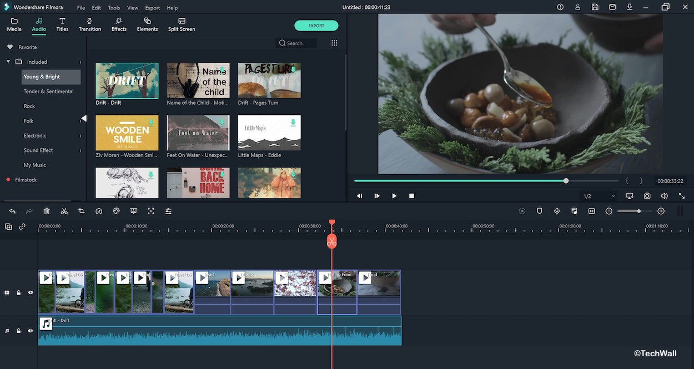

 

# Filmora X 

Filmora `simplified` advanced feature to save your `time` and `effort`. It’s simple in Filmora X. `Rotate`, `Trim`, `Split` & `Merge Videos` With Software. Supports `480+ Effects`, `50+ Formats` & `4K` Editing Support.

 
 

 

> No Watermark on exported videos, Licensed copy, All pro fratures unlocked !

 

  
<b><i>Wondershare Filmora Crack X Key Features</i></b>

   
  <ul>
    
   <li>Motion Tracking: Filmora X allows you to seamlessly attach an item to a moving object.</li>
   <li>Zoom and Pan: If you’ve ever watched a Ken Burns movie, you know how awesome zooming and panning is. With Filmora, you can easily do it.</li>
   <li>Color Matching: This feature is designed to match the colors of selected clips to a different frame in another clip.</li>
   <li>Keyframes – Easily adjust any animation by combining keyframes to change the position, scale, opacity, and rotation of the clip.</li>
   <li>Stabilization: Smooth, stabilized video is something you should never take for granted because it looks great, and with Filmora Cracked you can easily achieve that.</li>
   <li>Mute Sound: With this feature, you can mute the background music to keep your monologues or dialogue clear while listening to your monologues.</li>
   <li>Color Grading – The video you shoot with your camera doesn’t always look the way you want it to. If you really want a better-looking video, go ahead and rate the Filmora Cracked color.</li>
   <li>Green Screen: If you’re a YouTube streamer or just someone who loves to do little sketches or clips, a green screen can help you easily overlap objects.</li>
   <li>Tilt-Shift – The tilt-shift effect is something that requires a suitable lens which can be a bit expensive, and Filmora key free can do it very efficiently.</li>
   <li>Picture in Picture – If you want to give your project a futuristic feel, you can do so with the picture in picture feature.</li>
   <li>Shortcuts: You can create keyboard shortcuts using new keyboard shortcut commands.</li>
   <li>Effects Library: Filmora X includes 30 new elements and 9 featured titles.</li>
   <li>Dark Mode: Filmora X’s new dark mode lets you edit videos while enjoying your eyes.</li>
   <li>Basic functions: Filmora X Activation Key includes many basic video editing functions, such as splitting, rotating, cropping, cropping, brightness control, and volume control.</li>

  </ul>
   

  
<b><i>System Requirements</i></b>

   
  <ul>
    
  <li>Supported OS: Windows 7/Windows 8.1/Windows 10 ( 64 bit OS).</li>
  <li>Processor: Intel i3 or better multicore processor, 2GHz or above. (Intel 6th Gen or newer CPU recommended for HD and 4K Videos).</li>
  <li>RAM: 4 GB RAM (8GB required for HD and 4K videos).</li>
  <li>Graphics: Intel HD Graphics 5000 or later; NVIDIA GeForce GTX 700 or later; AMD Radeon R5 or later. 2 GB VRAM (4GB required for HD and 4K videos).</li>
  <li>Disk: At least 10GB free hard-disk space for installation (SSD-Solid State Disk recommended for editing HD and 4K videos).</li>
    
  </ul>

 

## Latest Google Drive Download Links
 <li> &nbsp;&nbsp; Filmora X Cracked Desktop Installer : <a href='https://drive.google.com/drive/folders/1-4Hf6SufsDtVJ2adJ5lW5vWeeZe65HSW?usp=sharing'>Redirect to Drive</a> 
 <li> &nbsp;&nbsp; Filmora X Portable Desktop Application : <a href='https://drive.google.com/drive/folders/1tp15fFlYHCSslnXP4iPVu8dB0lEXFtCv?usp=sharing'>Redirect to Drive</a>
